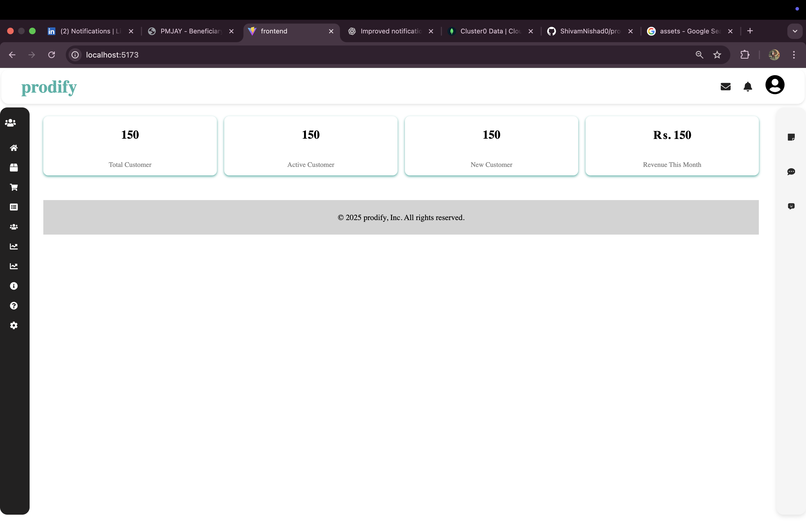
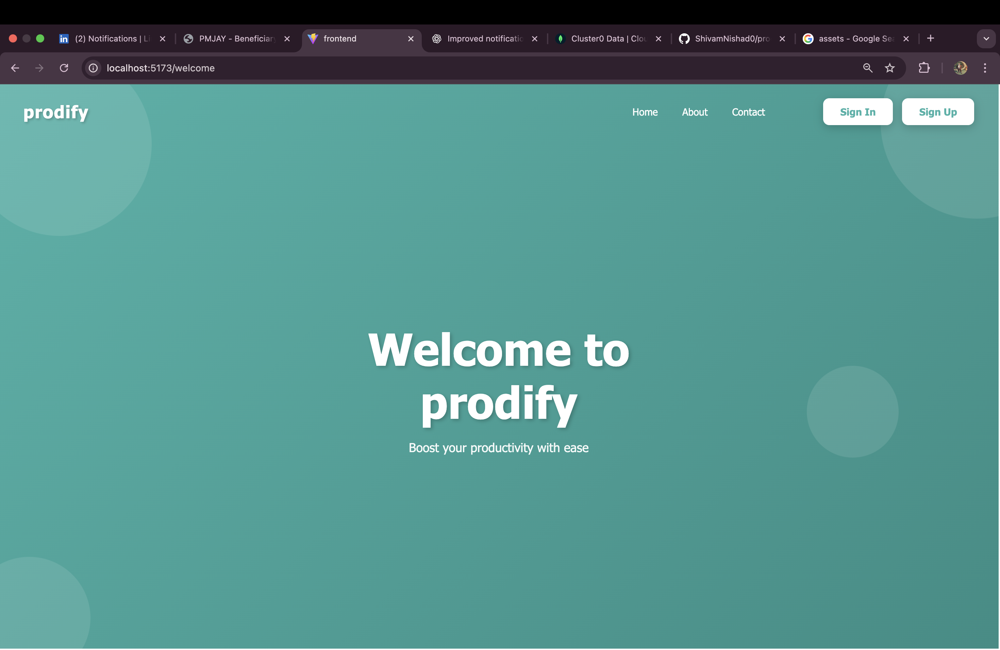
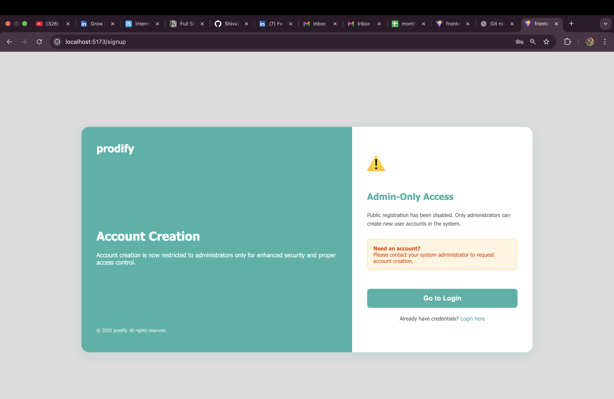
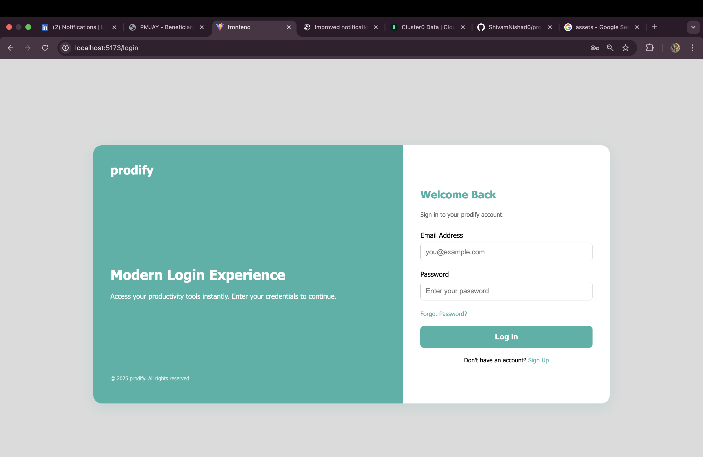
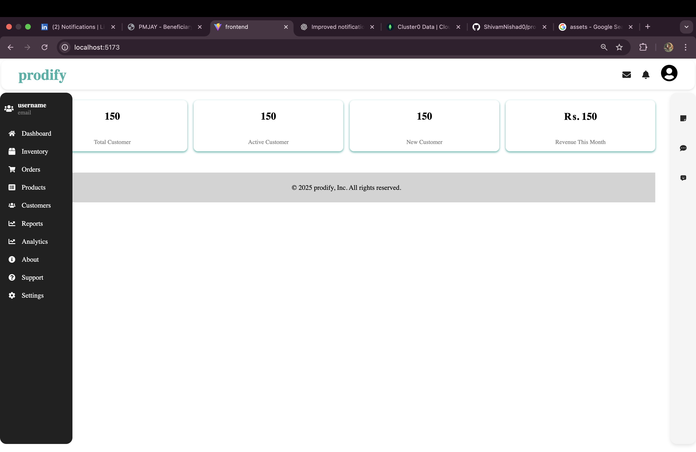

# 🚀 Prodify CRM

A comprehensive, full-stack Customer Relationship Management (CRM) system built with React and Node.js/Express. Manage your customers, products, orders, and analytics all in one powerful platform.



## 📋 Table of Contents

- [Features](#-features)
- [Tech Stack](#-tech-stack)
- [Project Structure](#-project-structure)
- [Screenshots](#-screenshots)
- [Prerequisites](#-prerequisites)
- [Installation](#-installation)
- [Seeding Data](#-seeding-data)
- [Running the Application](#-running-the-application)
- [API Documentation](#-api-documentation)
- [Environment Variables](#-environment-variables)
- [Testing](#-testing)
- [Deployment](#-deployment)
- [Contributing](#-contributing)
- [License](#-license)
- [Support](#-support)

---

## ✨ Features

### Core Functionality
- **👤 User Authentication & Authorization** - Secure JWT-based authentication with role-based access control (Admin, User)
- **👥 Customer Management** - Complete CRUD operations for customer information, contact details, and status tracking
- **📦 Product Catalog** - Comprehensive product management with categories, pricing, and inventory tracking
- **🛒 Order Processing** - Streamlined order creation, tracking, and status management
- **📊 Inventory Tracking** - Real-time inventory management with stock level monitoring
- **📈 Analytics & Reporting** - Interactive charts and dashboards for data-driven insights

### Additional Features
- **📝 Notes & Notifications** - Internal communication and activity tracking
- **💬 Messages** - Customer communication history and management
- **⚙️ Settings** - Customizable system preferences and profile management
- **🆘 Support** - Help resources and system documentation
- **🔐 Admin Panel** - Administrative controls and user management

---

## 🛠 Tech Stack

### Frontend
| Technology | Purpose |
|------------|---------|
| **React 19** | Modern React with hooks and functional components |
| **React Router DOM** | Client-side routing and navigation |
| **Vite** | Fast build tool and development server |
| **Chart.js** | Interactive charts and data visualization |
| **React ChartJS 2** | React wrapper for Chart.js |
| **Axios** | HTTP client for API requests |
| **date-fns** | Date formatting and manipulation |
| **Lucide React** | Beautiful icons |
| **React Icons** | Icon library |
| **ESLint** | Code linting and quality assurance |

### Backend
| Technology | Purpose |
|------------|---------|
| **Node.js** | Server-side JavaScript runtime |
| **Express.js 5** | Web application framework |
| **MongoDB** | NoSQL database |
| **Mongoose** | MongoDB object modeling (ODM) |
| **JWT** | JSON Web Tokens for authentication |
| **bcryptjs** | Password hashing and validation |
| **Nodemailer** | Email sending capability |
| **CORS** | Cross-Origin Resource Sharing |
| **dotenv** | Environment variable management |

---

## 📁 Project Structure

```
prodify-crm/
├── asset/                          # Static assets
│   └── img/                        # Project screenshots
│       ├── Home_Page.png
│       ├── Sidebar.png
│       ├── Signin_Page.png
│       ├── Signup_Page.png
│       └── Welcome_Page.png
├── frontend/                       # React frontend application
│   ├── public/                     # Static public assets
│   ├── src/
│   │   ├── assets/                 # Application assets
│   │   ├── components/             # React components
│   │   │   ├── charts/             # Analytics chart components
│   │   │   │   ├── CustomerChart.jsx
│   │   │   │   ├── OrderStatusChart.jsx
│   │   │   │   ├── RevenueChart.jsx
│   │   │   │   └── SalesByCategoryChart.jsx
│   │   │   ├── *.jsx               # Page and UI components
│   │   │   └── *.css               # Component styles
│   │   ├── contexts/               # React contexts (AuthContext, etc.)
│   │   ├── utils/                  # Utility functions
│   │   ├── App.jsx                 # Main application component
│   │   ├── main.jsx                # Application entry point
│   │   ├── index.css               # Global styles
│   │   └── colors.js               # Color theme configuration
│   ├── index.html                  # HTML entry point
│   ├── package.json                # Frontend dependencies
│   ├── vite.config.js              # Vite configuration
│   └── eslint.config.js            # ESLint configuration
├── backend/                        # Node.js backend API
│   ├── models/                     # Mongoose data models
│   │   ├── Customer.js             # Customer schema
│   │   ├── Inventory.js            # Inventory schema
│   │   ├── Message.js              # Message schema
│   │   ├── Note.js                 # Note schema
│   │   ├── Notification.js         # Notification schema
│   │   ├── Order.js                # Order schema
│   │   ├── Product.js              # Product schema
│   │   ├── Tender.js               # Tender schema
│   │   └── User.js                 # User schema
│   ├── routes/                     # API route handlers
│   │   ├── admin.js                # Admin-specific routes
│   │   ├── analytics.js            # Analytics and reporting
│   │   ├── auth.js                 # Authentication routes
│   │   ├── customers.js            # Customer management
│   │   ├── inventory.js            # Inventory operations
│   │   ├── messages.js             # Messaging system
│   │   ├── notes.js                # Notes management
│   │   ├── notifications.js        # Notification handling
│   │   ├── orders.js               # Order processing
│   │   ├── products.js             # Product management
│   │   └── tenders.js              # Tender management
│   ├── middleware/                 # Custom middleware
│   │   ├── adminAuth.js            # Admin authentication
│   │   └── auth.js                 # JWT authentication
│   ├── seedAdmin.js                # Admin user seeding
│   ├── seedCustomers.js            # Customer data seeding
│   │   ├── seedOrders.js           # Order data seeding
│   │   ├── seedTenders.js          # Tender data seeding
│   ├── server.js                   # Main server entry point
│   ├── package.json                # Backend dependencies
│   └── README.md                   # Backend documentation
├── .gitignore                      # Git ignore rules
└── README.md                       # This file
```

---

## 📸 Screenshots

### Welcome Page

*The landing page introducing users to the CRM system with modern, clean design*

### Sign Up Page

*User registration form with validation and secure password requirements*

### Sign In Page

*Secure login interface with JWT-based authentication*

### Dashboard Home

*Main dashboard displaying key metrics, revenue charts, and recent activities*

### Navigation Sidebar

*Intuitive navigation menu with collapsible sidebar for all CRM modules*

---

## 🔧 Prerequisites

Before you begin, ensure you have the following installed:

| Software | Version | Purpose |
|----------|---------|---------|
| **Node.js** | v16 or higher | JavaScript runtime |
| **MongoDB** | v4.4 or higher | Database server |
| **npm** | v7 or higher | Package manager |
| **Git** | Latest | Version control |

---

## 📦 Installation

### 1. Clone the Repository

```bash
git clone <repository-url>
cd prodify-crm
```

### 2. Install Backend Dependencies

```bash
cd backend
npm install
```

### 3. Install Frontend Dependencies

```bash
cd ../frontend
npm install
```

### 4. Configure Environment Variables

Create a `.env` file in the `backend` directory:

```env
# Server Configuration
PORT=5000
NODE_ENV=development

# MongoDB Connection
MONGODB_URI=mongodb://localhost:27017/crm

# JWT Authentication
JWT_SECRET=your_super_secret_jwt_key_change_in_production
JWT_EXPIRE=7d

# Admin User Configuration (optional)
INITIAL_ADMIN_EMAIL=admin@prodify.com
INITIAL_ADMIN_PASSWORD=admin123
INITIAL_ADMIN_NAME=System Administrator

# Email Configuration (optional)
EMAIL_SERVICE=gmail
EMAIL_USER=your_email@gmail.com
EMAIL_PASS=your_app_password

# CORS Origins
CORS_ORIGINS=http://localhost:5173,http://localhost:5174
```

---

## 🌱 Seeding Data

The project includes seed scripts to populate the database with sample data for testing and development.

### Seeding Order (Important!)

Always seed in this order to maintain referential integrity:

1. **Admin User** → 2. **Customers** → 3. **Products** → 4. **Orders** → 5. **Tenders**

### Seed Admin User

Creates the initial admin account for system access:

```bash
cd backend
node seedAdmin.js
```

**Default Credentials:**
- Email: `admin@prodify.com`
- Password: `admin123`

> ⚠️ **Security Note:** Change the admin password after first login!

### Seed Customers

Populates the database with sample customer data:

```bash
cd backend
node seedCustomers.js
```

**Creates 8 sample customers with various statuses (active, inactive, prospect)**

### Seed Products

Populates the database with sample product data:

```bash
cd backend
node seedProducts.js
```

**Creates various products with pricing and categories**

### Seed Orders

Populates the database with sample order data:

```bash
cd backend
node seedOrders.js
```

**Creates 10 sample orders linked to customers and products**

> 📋 **Prerequisite:** Run `seedCustomers.js` and `seedProducts.js` first!

### Seed Tenders

Populates the database with sample government/corporate tenders:

```bash
cd backend
node seedTenders.js
```

**Creates 5 sample tenders with full details**

### Seed All Data (Quick Script)

Create a combined seed script for convenience:

```bash
# Run all seeds in order
node seedAdmin.js && \
node seedCustomers.js && \
node seedProducts.js && \
node seedOrders.js && \
```

---

## 🚀 Running the Application

### Development Mode

#### Start the Backend Server

```bash
cd backend
npm run dev
```

The backend will run on `http://localhost:5000`

#### Start the Frontend (in a new terminal)

```bash
cd frontend
npm run dev
```

The frontend will run on `http://localhost:5173`

### Production Mode

#### Build the Frontend

```bash
cd frontend
npm run build
```

The built files will be in the `frontend/dist` directory.

#### Start the Backend

```bash
cd backend
npm start
```

The application will be available at `http://localhost:5000`

### Verify Installation

1. Open `http://localhost:5173` in your browser
2. Log in with admin credentials:
   - Email: `admin@prodify.com`
   - Password: `admin123`
3. Explore the dashboard and various features

---

## 📡 API Documentation

For detailed API documentation, see the [Backend README](./backend/README.md)

### Key API Endpoints

#### Authentication
| Method | Endpoint | Description |
|--------|----------|-------------|
| POST | `/api/auth/register` | Register new user |
| POST | `/api/auth/login` | User login |
| POST | `/api/auth/forgot-password` | Request password reset |
| POST | `/api/auth/reset-password` | Reset password |

#### Customers
| Method | Endpoint | Description |
|--------|----------|-------------|
| GET | `/api/customers` | List all customers |
| GET | `/api/customers/:id` | Get customer by ID |
| POST | `/api/customers` | Create new customer |
| PUT | `/api/customers/:id` | Update customer |
| DELETE | `/api/customers/:id` | Delete customer |

#### Products
| Method | Endpoint | Description |
|--------|----------|-------------|
| GET | `/api/products` | List all products |
| GET | `/api/products/:id` | Get product by ID |
| POST | `/api/products` | Create new product |
| PUT | `/api/products/:id` | Update product |
| DELETE | `/api/products/:id` | Delete product |

#### Orders
| Method | Endpoint | Description |
|--------|----------|-------------|
| GET | `/api/orders` | List all orders |
| GET | `/api/orders/:id` | Get order by ID |
| POST | `/api/orders` | Create new order |
| PUT | `/api/orders/:id` | Update order status |
| DELETE | `/api/orders/:id` | Delete order |

#### Analytics
| Method | Endpoint | Description |
|--------|----------|-------------|
| GET | `/api/analytics/dashboard` | Dashboard analytics |
| GET | `/api/analytics/sales` | Sales data and trends |


### Authentication

Most endpoints require JWT authentication. Include the token in the Authorization header:

```http
Authorization: Bearer <your_jwt_token>
```

---

## 🔐 Environment Variables

### Backend Variables

| Variable | Required | Default | Description |
|----------|----------|---------|-------------|
| `PORT` | No | 5000 | Server port number |
| `NODE_ENV` | No | development | Environment mode |
| `MONGODB_URI` | Yes | - | MongoDB connection string |
| `JWT_SECRET` | Yes | - | JWT signing secret |
| `JWT_EXPIRE` | No | 7d | JWT expiration time |
| `INITIAL_ADMIN_EMAIL` | No | admin@prodify.com | Initial admin email |
| `INITIAL_ADMIN_PASSWORD` | No | admin123 | Initial admin password |
| `EMAIL_SERVICE` | No | - | Email service provider |
| `EMAIL_USER` | No | - | Email username |
| `EMAIL_PASS` | No | - | Email password |
| `CORS_ORIGINS` | No | localhost:5173 | Allowed CORS origins |

---

## 🧪 Testing

Run the test suites:

```bash
# Backend tests
cd backend
npm test

# Frontend tests
cd frontend
npm test
```

---

## 📦 Deployment

### Frontend Deployment

Deploy the frontend to any static hosting service:

```bash
cd frontend
npm run build
# Deploy the dist/ folder to:
# - Vercel
# - Netlify
# - AWS S3
# - GitHub Pages
```

### Backend Deployment

Deploy the backend to your preferred Node.js hosting service:

```bash
cd backend
npm start
# Deploy to:
# - Heroku
# - Render
# - Railway
# - AWS EC2
# - DigitalOcean
```

> ⚠️ Ensure all environment variables are properly configured in your hosting environment!

---

## 🤝 Contributing

Contributions are welcome! Please feel free to submit a Pull Request.

1. **Fork the repository**
2. **Create your feature branch** (`git checkout -b feature/AmazingFeature`)
3. **Commit your changes** (`git commit -m 'Add some AmazingFeature'`)
4. **Push to the branch** (`git push origin feature/AmazingFeature`)
5. **Open a Pull Request**

---

## 📄 License

This project is licensed under the MIT License - see the [LICENSE](LICENSE) file for details.

---

## 📞 Support

For support and questions:

- 📧 Email: support@prodify.com
- 📖 Documentation: Check the `/docs` folder
- 🐛 Issues: Create an issue in the repository
- 💬 Discussions: Use the GitHub Discussions feature

---

## 🙏 Acknowledgments

- [MongoDB](https://www.mongodb.com/) - Robust database solution
- [React](https://reactjs.org/) - Excellent frontend framework
- [Express.js](https://expressjs.com/) - Minimal and flexible web framework
- [Chart.js](https://www.chartjs.org/) - Beautiful charts
- [All Contributors](https://github.com/prodify/crm/graphs/contributors) - Thanks for your contributions!

---

**Built with ❤️ by the Prodify Development Team**

Happy CRM Management! 🎉