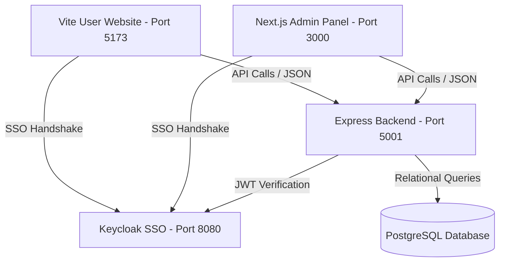
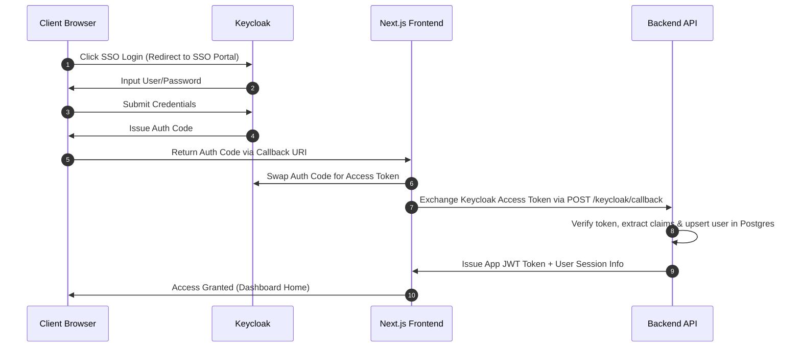
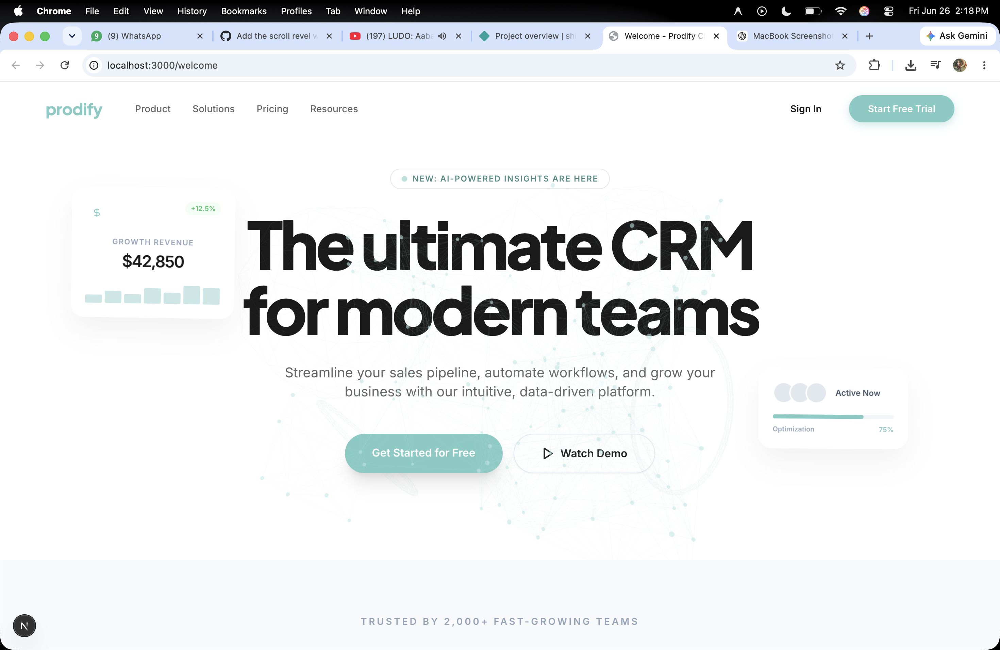
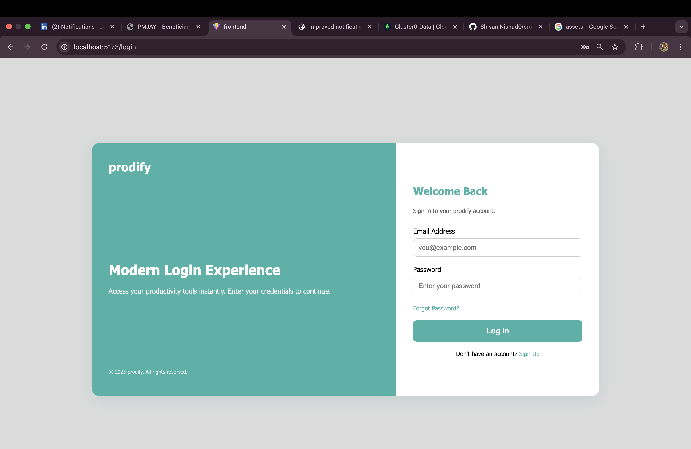
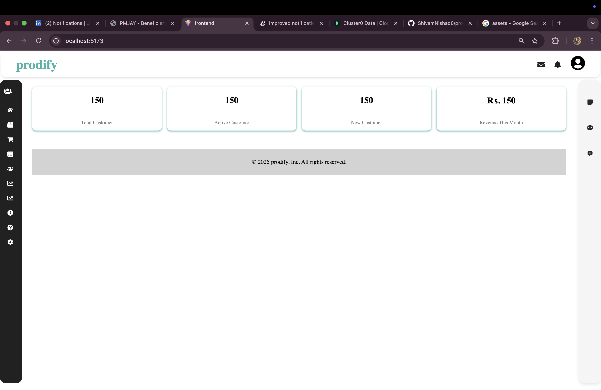

# 🚀 Prodify CRM

Prodify CRM is a premium, modern, full-stack Customer Relationship Management (CRM) system designed with a dual-authentication strategy. It features a Next.js-based Admin Dashboard for company staff and a Vite-based Website Portal for public clients, both backed by an Express.js API, PostgreSQL database (via Sequelize ORM), and a unified Single Sign-On (SSO) experience powered by Keycloak.

---

## 📋 Table of Contents
*   [Project Overview](#-project-overview)
*   [Features](#-features)
*   [Tech Stack](#-tech-stack)
*   [Architecture](#-architecture)
*   [Folder Structure](#-folder-structure)
*   [Installation](#-installation)
*   [Environment Variables](#-environment-variables)
*   [Keycloak Setup](#-keycloak-setup)
*   [Authentication Flow](#-authentication-flow)
*   [API Endpoints](#-api-endpoints)
*   [Screenshots Section](#-screenshots-section)
*   [Future Improvements](#-future-improvements)
*   [License](#-license)

---

## 🔍 Project Overview

Prodify CRM enables enterprises to manage customer relations, track product catalogs, coordinate orders, monitor real-time inventories, and leverage powerful analytics panels.

The system is split into three main modules:
1.  **Backend API**: High-performance Node/Express REST API using Sequelize ORM to coordinate with a local/cloud PostgreSQL cluster.
2.  **Next.js Admin Panel**: A premium Next.js dashboard built for company staff and administrators.
3.  **Vite Website Portal**: A fast client-facing interface allowing users to access services, orders, and products.

---

## ✨ Features

*   **🔐 Dual-Authentication System**:
    *   **Local Database Login**: Secure password authentication via bcrypt & JWT for local system administrators.
    *   **Single Sign-On (SSO)**: Federated OAuth2/OIDC login powered by Keycloak for staff and website users.
*   **👥 Customer & Tender Tracking**: Full CRUD management of client profiles, lifecycle stages, and tender bids.
*   **📦 Product & Inventory Coordination**: Category-wise stock lists with automatic threshold alerts and transaction logs.
*   **🛒 Order Lifecycle Management**: Smooth order creation, progress tracking, and analytics reporting.
*   **📊 Premium Interactive Analytics**: Real-time sales trends, category performance, and client metrics visualized through Chart.js.
*   **💬 Internal Collaboration Tools**: Internal messaging systems, team task lists, notifications, and activity notes.

---

## 🛠 Tech Stack

### Backend
*   **Runtime**: Node.js
*   **Framework**: Express.js
*   **Database**: PostgreSQL
*   **ORM**: Sequelize
*   **Authentication**: JSON Web Tokens (JWT), bcryptjs, and `keycloak-connect`

### Admin Panel (Frontend)
*   **Framework**: Next.js 16 (Turbopack) & React 19
*   **Styling**: Vanilla CSS, Tailwind CSS
*   **Icons & Motion**: Lucide React, Framer Motion
*   **State & HTTP**: React Context API, Axios, and `keycloak-js`

### Website Portal (Vite Client)
*   **Framework**: Vite & React 19
*   **Routing**: React Router DOM
*   **State & HTTP**: Axios, `keycloak-js`

---

## 🏗 Architecture


```mermaid
graph TD
    A[Vite User Website - Port 5173] -->|API Calls / JSON| C[Express Backend - Port 5001]
    B[Next.js Admin Panel - Port 3000] -->|API Calls / JSON| C
    A -->|SSO Handshake| D[Keycloak SSO - Port 8080]
    B -->|SSO Handshake| D
    C -->|JWT Verification| D
    C -->|Relational Queries| E[(PostgreSQL Database)]
```

---

## 📁 Folder Structure

```
prodify-crm/
├── backend/                       # Express.js REST API
│   ├── config/                    # Sequelize DB & Keycloak configurations
│   ├── middleware/                # Admin auth & general JWT verification
│   ├── models/                    # Sequelize PostgreSQL model definitions
│   ├── routes/                    # REST routes (auth, customers, orders, etc.)
│   ├── seedAdmin.js               # Administrator PostgreSQL seeding script
│   ├── setupKeycloak.js           # Keycloak realm automations
│   ├── server.js                  # Express Entry point
│   └── package.json
├── frontend/                      # Next.js Admin Panel Dashboard
│   ├── public/                    # Static landing assets
│   ├── src/
│   │   ├── app/                   # Next.js App router page files
│   │   ├── core/                  # Axios clients & Keycloak configs
│   │   ├── features/              # Feature modules (Auth, Dashboard)
│   │   ├── layouts/               # Dashboard Layout wrappers
│   │   └── providers/             # Global Context providers (AuthProvider)
│   └── package.json
└── website/                       # Vite Client Website Portal
    ├── public/                    # Static portal assets
    ├── src/
    │   ├── components/            # UI components (Navbar, Login, etc.)
    │   ├── contexts/              # Authentication contexts
    │   └── main.jsx               # Vite Entry Point
    └── package.json
```

---

## 🚀 Installation

### 1. Database Configuration
Ensure PostgreSQL is active and create a database named `prodify_crm`:
```sql
CREATE DATABASE prodify_crm;
```

### 2. Configure Environment Variables
Set up env variables for each folder as detailed in the [Environment Variables](#-environment-variables) section.

### 3. Install Dependencies & Build
Install node modules for all workspaces:
```bash
# In backend/
cd backend && npm install

# In frontend/
cd ../frontend && npm install

# In website/
cd ../website && npm install
```

### 4. Running the Project Sequentially
Start the servers in separate terminal tabs:

**Step A (SSO)**:
```bash
./run-keycloak.sh
```

**Step B (Seeding DB)**:
```bash
cd backend
node seedAdmin.js
```

**Step C (Backend)**:
```bash
cd backend && npm run dev
```

**Step D (Admin Panel)**:
```bash
cd frontend && nvm use 20 && npm run dev
```

**Step E (Website Portal)**:
```bash
cd website && npm run dev
```

---

## 🔐 Environment Variables

### Backend (`backend/.env`)
```env
PORT=5001
JWT_SECRET=your_super_secret_jwt_key
JWT_EXPIRE=7d

# PostgreSQL Configuration
PGDATABASE=prodify_crm
PGUSER=postgres_user
PGPASSWORD=postgres_password
PGHOST=localhost
PGPORT=5432

# Keycloak Integration
KEYCLOAK_URL=http://127.0.0.1:8080
KEYCLOAK_REALM=prodify
KEYCLOAK_CLIENT_ID=crm-backend
KEYCLOAK_CLIENT_SECRET=your_confidential_client_secret
KEYCLOAK_ADMIN_USERNAME=admin
KEYCLOAK_ADMIN_PASSWORD=admin
```

### Next.js Frontend (`frontend/.env.local`)
```env
NEXT_PUBLIC_API_URL=http://localhost:5001/api
NEXT_PUBLIC_KEYCLOAK_URL=http://localhost:8080
NEXT_PUBLIC_KEYCLOAK_REALM=prodify
NEXT_PUBLIC_KEYCLOAK_CLIENT_ID=crm-backend
```

### Vite Website Portal (`website/.env`)
```env
VITE_API_URL=http://localhost:5001/api
VITE_KEYCLOAK_URL=http://localhost:8080
VITE_KEYCLOAK_REALM=prodify
VITE_KEYCLOAK_CLIENT_ID=crm-website
```

---

## ⚙️ Keycloak Setup

1.  Create a realm named `prodify`.
2.  Configure two clients:
    *   `crm-backend`: Set as a **Public Client** (using Standard Authorization code flow with PKCE). Add valid Redirect URIs to `http://localhost:3000/*`.
    *   `crm-website`: Set as a **Public Client** with valid Redirect URIs pointing to `http://localhost:5173/*`.
3.  Add roles: `admin`, `manager`, `employee`.
4.  Optionally run the auto-creation script to populate a default test user:
    ```bash
    cd backend && node createTestUser.js
    ```

---

## 🔄 Authentication Flow


```mermaid
sequenceDiagram
    autonumber
    Client Browser->>Keycloak: Click SSO Login (Redirect to SSO Portal)
    Keycloak->>Client Browser: Input User/Password
    Client Browser->>Keycloak: Submit Credentials
    Keycloak->>Client Browser: Issue Auth Code
    Client Browser->>Next.js Frontend: Return Auth Code via Callback URI
    Next.js Frontend->>Keycloak: Swap Auth Code for Access Token
    Next.js Frontend->>Backend API: Exchange Keycloak Access Token via POST /keycloak/callback
    Backend API->>Backend API: Verify token, extract claims & upsert user in Postgres
    Backend API->>Next.js Frontend: Issue App JWT Token + User Session Info
    Next.js Frontend->>Client Browser: Access Granted (Dashboard Home)
```

---

## 📡 API Endpoints

### Authentication
*   `POST /api/auth/register` - Create a new local user (Admin only).
*   `POST /api/auth/login` - Local JWT credential login.
*   `GET /api/auth/verify` - Check current auth session.
*   `POST /api/keycloak/callback` - Callback for exchanging Keycloak tokens for local DB sessions.

### Customers
*   `GET /api/customers` - Fetch all customer listings.
*   `POST /api/customers` - Create a new customer entry.
*   `PUT /api/customers/:id` - Update existing customer details.
*   `DELETE /api/customers/:id` - Remove customer listing.

### Messaging & Notes
*   `GET /api/messages` - Retrieve message lists.
*   `POST /api/notes` - Add team collaboration notes.

---

## 📸 Screenshots Section

### Welcome Screen


### Sign In Dashboard


### Admin Central Dashboard


---

## 🔮 Future Improvements

*   **Real-time Synchronization**: Integrate WebSockets for real-time chat updates and team metrics.
*   **Advanced Analytics Engine**: Deploy predictive data models to forecast sales trends based on customer activity logs.
*   **Keycloak Client Roles Mapping**: Automate granular role-mapping so changes in Keycloak roles immediately sync permissions in Next.js panels.

---

## 📄 License

This project is licensed under the MIT License - see the [LICENSE](LICENSE) file for details.